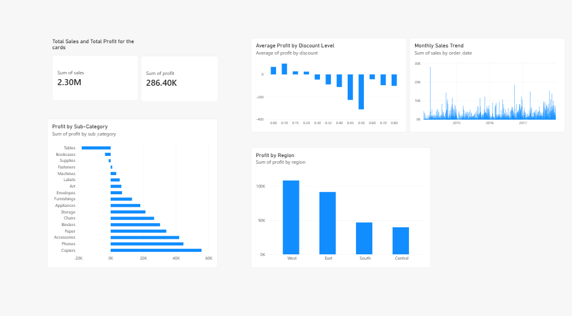

# Superstore Sales Analysis

## Overview
Analysis of 9,994 retail orders to find which products, regions and
discount levels drive profit and loss. Tools: Python (pandas), MySQL, Power BI.

## Process
1. Python: loaded the data, checked for missing values and duplicates,
   converted date columns, saved a cleaned file.
2. MySQL: loaded the data into a table and answered business questions with SQL.
3. Power BI: built a dashboard of the key findings.

## Key findings
- Tables, Bookcases and Supplies were the only unprofitable sub-categories
  (Tables alone lost about $17.7K).
- Orders with discounts of 30% or more were unprofitable on average.
- Tables and Bookcases have high average discounts, but Binders have the
  highest and stay profitable, so discounts don't explain everything.

## Recommendations
- Review discount rules on Furniture and cap discounts around 20%.
- Investigate Supplies separately (pricing or cost issue).

## Files
- `explore.py`, `prep_for_sql.py`: cleaning and preparation
- `load_to_mysql.py`: loads the data into MySQL
- `Superstore_Dashboard.pbix`: Power BI dashboard
